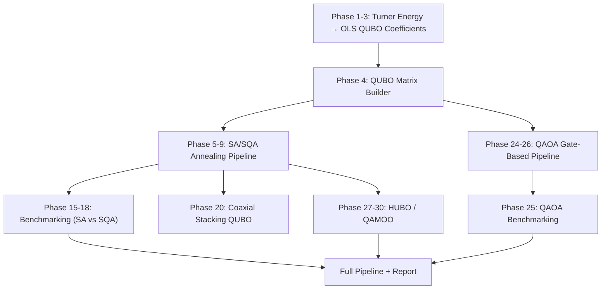

# 🧬 Master Research Plan: Quantum-Assisted RNA Inverse Folding

> **Project:** QUBO-based Quantum Optimization for RNA Inverse Folding
> **Researcher:** Kasunika Karunarathne — Computer Engineering, University of Peradeniya
> **Last Updated:** 2026-09-19
> **Current Status:** Level 1 — QAOA pipeline built, initial results in, performance needs improvement

---

## 📌 How to Use This Plan

This document is the **single source of truth** for the entire research project. If you lose a chat session, start a new one by referencing this file. After completing each sub-task, we will update the status markers:

| Marker | Meaning |
|:---:|:---|
| `[ ]` | Not started |
| `[/]` | In progress |
| `[x]` | Completed |
| `[!]` | Blocked / Needs decision |

---

## 🏗️ Project Architecture Overview

---

## 📊 Current Results Summary (Where We Stand)

### SA/SQA Annealing Pipeline (Phases 1-20) — ✅ Strong Baseline

| Structure | Best Method | Success Rate | Avg Defect |
|:---|:---|:---:|:---:|
| Simple Hairpin (15 bases) | Normal QUBO (SA) | **100%** | 0.01 |
| Stickshift (17 bases) | Normal QUBO (SA) | **100%** | 0.01 |
| Corner Bulge (26 bases) | Extended QUBO (SA) | **100%** | 0.01 |
| InfoRNA (34 bases) | Extended QUBO (SA/SQA) | **38-39%** | 0.02 |

### QAOA Gate-Based Pipeline (Phase 25) — ⚠️ Needs Improvement

| Target Structure | Qubits | Success Rate | Spearman Corr | Issue |
|:---|:---:|:---:|:---:|:---|
| `((((...)))).` | 12 | **68.0%** | 0.8289 | Good |
| `(((((......)))))` | 15 | **94.0%** | 0.9247 | Excellent |
| `((....)).((.....))` | 12 | **0.0%** | -0.1092 | ❌ Multi-stem failure |
| `..((((((((.....)).))))))..` | 24 | **24.0%** | 0.8680 | Degraded |
| `(((((.....))..((.........)))))` | 21 | **0.0%** | 0.4818 | ❌ Multi-stem failure |
| 3 structures (30-41 qubits) | >25 | N/A | N/A | ❌ OOM — too many qubits |

### Key Diagnoses

1. **Multi-stem structures completely fail** — QAOA cannot find the ground state for targets with multiple stems (e.g., 3-way junctions). The Spearman correlation drops to near-zero or negative.
2. **Qubit scalability wall at ~25 qubits** — Statevector simulation hits RAM limits. MPS doesn't converge well for dense QAOA entanglement.
3. **Penalty weight imbalance** — Phase 25 uses `penalty_weight=10` (reduced from SA's 100), but multi-stem structures need different tuning.
4. **COBYLA gets stuck in local minima** — Flat energy landscapes with many degenerate states trap the gradient-free optimizer.

---

# 🎯 LEVEL 1: Fix & Optimize QAOA Pipeline

> **Goal:** Take the existing QAOA implementation from 24-68% → 70%+ success on structures ≤ 25 qubits

## 1.1 📚 Learn: Foundations of Variational Quantum Algorithms

> [!NOTE]
> Understanding WHY QAOA fails on your problem is more important than blindly adding circuit depth.

- [ ] **1.1.1** Study the QAOA algorithm in depth
  - [ ] Read: Farhi et al., "A Quantum Approximate Optimization Algorithm" (2014) — the original paper
  - [ ] Read: Hadfield et al., "From the QAOA to the Quantum Alternating Operator Ansatz" (2019) — generalized mixers
  - [ ] Understand: Cost Hamiltonian, Mixer Hamiltonian, `p` layers, the role of `γ` and `β` parameters
  - [ ] **Key concept:** Why `reps=1` (p=1) is fundamentally limited — it can only explore states that are reachable by a single alternation. Multi-stem problems need richer entanglement.

- [ ] **1.1.2** Study Barren Plateaus and trainability
  - [ ] Read: McClean et al., "Barren Plateaus in Quantum Neural Network Training Landscapes" (2018)
  - [ ] Understand why random initialization of parameters leads to exponentially vanishing gradients as qubit count increases
  - [ ] **Key concept:** Your `x0 = np.random.uniform(-0.01, 0.01, ...)` initialization is smart but insufficient for complex landscapes

- [ ] **1.1.3** Study QAOA warm-starting techniques
  - [ ] Read: Egger et al., "Warm-starting quantum optimization" (IBM, 2021)
  - [ ] Read: Tate et al., "Bridging classical and quantum with SDP initialized warm-started QAOA" (2023)
  - [ ] **Key concept:** Use classical SA/SQA solutions (which you already have!) to initialize QAOA parameters or quantum states

- [ ] **1.1.4** Study Qiskit ecosystem deeply
  - [ ] Complete: [Qiskit Textbook](https://learning.quantum.ibm.com/) — Chapters on VQE, QAOA, Primitives V2
  - [ ] Understand: `EstimatorV2` vs `SamplerV2`, `QAOAAnsatz`, `SparsePauliOp`
  - [ ] Understand: Transpilation, ISA circuits, optimization levels

### ✅ Checkpoint 1.1
> **Deliverable:** Write a 1-page summary (in `summaries/`) explaining in your own words: (a) why p=1 QAOA is limited, (b) what barren plateaus are and how they affect your 24-qubit case, (c) how warm-starting could help.

---

## 1.2 🔬 Research: Diagnose QAOA Failures

- [ ] **1.2.1** Analyze multi-stem failure mode
  - [ ] Run diagnostic on `((....)).((.....))` — extract QAOA energy landscape vs optimal bitstring energy
  - [ ] Compare QUBO matrix structure for single-stem vs multi-stem targets
  - [ ] Hypothesis: The multi-stem QUBO has a highly degenerate ground state manifold that p=1 QAOA cannot distinguish

- [ ] **1.2.2** Penalty weight sensitivity study
  - [ ] Run QAOA with penalty_weight = [1, 5, 10, 20, 50, 100] on all 5 computable structures
  - [ ] Plot: Success Rate vs Penalty Weight, Spearman Correlation vs Penalty Weight
  - [ ] Find the structure-specific sweet spot

- [ ] **1.2.3** QAOA depth study (reps/layers)
  - [ ] Run with `reps` = [1, 2, 3, 5] on the 12-qubit and 15-qubit structures
  - [ ] Measure: Convergence speed, final energy, success rate
  - [ ] **Trade-off:** More reps = better approximation ratio BUT more parameters for COBYLA to optimize

- [ ] **1.2.4** Optimizer comparison
  - [ ] Test: COBYLA vs SPSA vs L-BFGS-B vs Nelder-Mead vs ADAM (gradient-based via parameter shift)
  - [ ] COBYLA is gradient-free and decent, but SPSA is designed for noisy quantum landscapes
  - [ ] Profile: Number of function evaluations to convergence, final solution quality

### ✅ Checkpoint 1.2
> **Deliverable:** A diagnostic report (`implementation_plan/qaoa_diagnostic_report.md`) with plots showing: penalty sensitivity, depth scaling, optimizer comparison. This determines the path for 1.3.

---

## 1.3 🛠️ Implement: QAOA Pipeline Improvements

- [ ] **1.3.1** Implement warm-start QAOA
  - [ ] Use your existing SA/SQA annealing results to initialize QAOA
  - [ ] Strategy A: **Parameter warm-start** — solve classically, use the classical solution to bias the initial `γ`, `β`
  - [ ] Strategy B: **State warm-start** — prepare an initial quantum state biased toward the classical solution (rather than the uniform superposition |+⟩)

- [ ] **1.3.2** Implement adaptive QAOA depth
  - [ ] Start with p=1, evaluate quality
  - [ ] If success < threshold → increase to p=2 and re-optimize
  - [ ] Use "layerwise training" — fix parameters of layer 1, optimize layer 2 parameters only

- [ ] **1.3.3** Improve the classical optimizer loop
  - [ ] Replace single COBYLA run with multi-start optimization (5-10 random restarts, keep best)
  - [ ] Implement SPSA optimizer as the primary optimizer (designed for quantum noisy landscapes)
  - [ ] Add early stopping if energy converges (save compute)

- [ ] **1.3.4** Structure-aware penalty tuning
  - [ ] Implement dynamic penalty scaling based on structural complexity metrics
  - [ ] Use the `calculate_structural_difficulty()` function from phase17 to auto-scale penalty_weight
  - [ ] Multi-stem structures get lower penalty to avoid drowning the physics signal

- [ ] **1.3.5** Re-benchmark improved QAOA pipeline
  - [ ] Run on all 8 target structures
  - [ ] Compare: Original Phase 25 results vs Improved results
  - [ ] Generate publication-quality comparison table and plots

### ✅ Checkpoint 1.3
> **Deliverable:** Updated `phase25_qaoa_benchmarking.py` with warm-start, multi-restart, and adaptive depth. Success rate target: **70%+ on structures ≤ 25 qubits**.

---

## 1.4 📝 Document & Update

- [ ] **1.4.1** Write Level 1 summary in `summaries/level1_qaoa_optimization.md`
- [ ] **1.4.2** Update this master plan with results and learnings
- [ ] **1.4.3** Decide on Level 2 path based on results

---

# 🎯 LEVEL 2: Scalability — Break the Qubit Barrier

> **Goal:** Handle structures requiring 30-60+ qubits using advanced decomposition and simulation techniques

## 2.1 📚 Learn: Quantum Simulation at Scale

- [ ] **2.1.1** Study Matrix Product States (MPS) for quantum simulation
  - [ ] Understand why MPS works for 1D-entangled systems but struggles with dense QAOA entanglement
  - [ ] Learn about bond dimension truncation and its effect on accuracy
  - [ ] **Key concept:** QAOA generates volume-law entanglement which MPS cannot efficiently represent

- [ ] **2.1.2** Study circuit cutting and quantum-centric supercomputing
  - [ ] Read: Peng et al., "Simulating Large Quantum Circuits on a Small Quantum Computer" (2020)
  - [ ] Read: IBM's quantum-centric supercomputing papers (2024-2025)
  - [ ] **Key concept:** Partition a large circuit into smaller sub-circuits, run each independently, combine classically

- [ ] **2.1.3** Study QUBO decomposition strategies
  - [ ] Graph partitioning for QUBO matrices (Kernighan–Lin, METIS)
  - [ ] Hierarchical decomposition: solve stems independently, then combine
  - [ ] The SWIFT-FMQA "sliding window" approach for RNA

### ✅ Checkpoint 2.1
> **Deliverable:** A research note explaining which scalability technique is most promising for your specific RNA QUBO structure.

---

## 2.2 🔬 Research: Choose a Scalability Strategy

- [ ] **2.2.1** Analyze QUBO graph structure for large RNA targets
  - [ ] Visualize the QUBO matrix sparsity pattern for 30+ qubit structures
  - [ ] Determine if the graph has natural cut points (stems are weakly coupled → good for partitioning)

- [ ] **2.2.2** Compare approaches
  - [ ] **Option A:** Circuit cutting — partition the QAOA circuit across multiple smaller runs
  - [ ] **Option B:** Stem-by-stem QAOA — solve each stem's QUBO independently with QAOA, combine classically
  - [ ] **Option C:** Hybrid quantum-classical — stems on QAOA, loops on classical (current Phase 25 approach, refined)
  - [ ] **Option D:** Tensor network simulation — use more efficient tensor network backends (e.g., `cuQuantum`)

- [ ] **2.2.3** Prototype the best 2 approaches on medium structures (20-30 qubits)

### ✅ Checkpoint 2.2
> **Deliverable:** Decision document with experimental evidence for the chosen scalability path.

---

## 2.3 🛠️ Implement: Scalable QAOA Pipeline

- [ ] **2.3.1** Implement the chosen decomposition strategy
- [ ] **2.3.2** Extend the benchmarking framework to handle 30-60 qubit structures
- [ ] **2.3.3** Re-run benchmarks on ALL 8 target structures (including the 3 that were previously OOM)
- [ ] **2.3.4** Compare against SA/SQA baseline on the same structures

### ✅ Checkpoint 2.3
> **Deliverable:** A working pipeline that can solve structures up to 60 qubits. Benchmark table comparing QAOA vs SA/SQA vs Classical (Vienna/DesiRNA).

---

## 2.4 📝 Document & Update

- [ ] **2.4.1** Write Level 2 summary
- [ ] **2.4.2** Update master plan
- [ ] **2.4.3** Decide on Level 3 path

---

# 🎯 LEVEL 3: Advanced Quantum Algorithms

> **Goal:** Explore advanced quantum algorithms beyond standard QAOA for better solution quality

## 3.1 📚 Learn: Beyond Vanilla QAOA

- [ ] **3.1.1** Study Filtering VQE (F-VQE)
  - [ ] Concept: Modify the cost landscape using filters to amplify the depth of optimal solution valleys
  - [ ] Claimed 10-100x convergence speedup over standard VQE/QAOA
  - [ ] Assess feasibility for RNA QUBO

- [ ] **3.1.2** Study QAOA with custom mixers (Quantum Alternating Operator Ansatz)
  - [ ] XY-mixer for constrained subspaces (e.g., enforce one-hot encoding natively in the circuit)
  - [ ] Grover-style mixers for feasibility preservation
  - [ ] **Key insight:** Your one-hot encoding constraints currently live in the penalty terms. Moving them into the mixer would dramatically reduce the search space.

- [ ] **3.1.3** Study Variational Quantum Eigensolver (VQE) with hardware-efficient ansatze
  - [ ] VQE uses general parameterized circuits rather than QAOA's structured alternating ansatz
  - [ ] More flexible but harder to train
  - [ ] Compare: QAOA ansatz vs hardware-efficient ansatz vs problem-inspired ansatz

- [ ] **3.1.4** Study Quantum Error Mitigation for NISQ hardware
  - [ ] Zero-Noise Extrapolation (ZNE) — run at multiple noise levels, extrapolate to zero
  - [ ] Probabilistic Error Cancellation (PEC)
  - [ ] Clifford Data Regression (CDR)
  - [ ] **Why this matters:** Even if your algorithm is perfect, hardware noise will destroy the results unless mitigated

### ✅ Checkpoint 3.1
> **Deliverable:** Comparative analysis document ranking these algorithms by expected performance on your RNA problem.

---

## 3.2 🔬 Research: Select & Prototype

- [ ] **3.2.1** Prototype constrained QAOA with XY-mixer on a small test case (12 qubits)
- [ ] **3.2.2** Prototype VQE with a problem-inspired ansatz
- [ ] **3.2.3** Compare convergence speed, solution quality, and qubit efficiency

## 3.3 🛠️ Implement: Best Advanced Algorithm

- [ ] **3.3.1** Full implementation of the chosen advanced algorithm
- [ ] **3.3.2** Integration with the existing pipeline (Turner energy → QUBO → Quantum Solver → Validation)
- [ ] **3.3.3** Full benchmark comparison: Standard QAOA vs Advanced Algorithm vs SA/SQA vs Classical

## 3.4 📝 Document & Update

- [ ] **3.4.1** Write Level 3 summary
- [ ] **3.4.2** Update master plan

---

# 🎯 LEVEL 4: Real Quantum Hardware Deployment

> **Goal:** Execute the optimized pipeline on real IBM quantum hardware and demonstrate quantum utility

## 4.1 📚 Learn: Quantum Hardware Practicalities

- [ ] **4.1.1** Study IBM Qiskit Runtime V2 deeply
  - [ ] Sessions vs Job mode vs Batch mode
  - [ ] Transpilation optimization levels (0-3)
  - [ ] ISA circuits and backend-specific qubit mapping

- [ ] **4.1.2** Study quantum noise models
  - [ ] Depolarizing noise, readout errors, crosstalk
  - [ ] Qiskit Aer noise models for realistic local simulation
  - [ ] Backend-specific calibration data

- [ ] **4.1.3** Study Warm-Start Hardware Strategy
  - [ ] Your existing plan: optimize locally → inject parameters → single hardware shot
  - [ ] Research more sophisticated warm-start approaches

## 4.2 🔬 Research: Hardware Selection & Noise Analysis

- [ ] **4.2.1** Compare available IBM backends (qubit count, error rates, connectivity)
- [ ] **4.2.2** Run noise model simulations matching your target backend
- [ ] **4.2.3** Determine if error mitigation (ZNE/PEC) is needed for your problem size

## 4.3 🛠️ Implement: Hardware Execution

- [ ] **4.3.1** Implement the warm-start hardware pipeline
  - [ ] Optimize `γ`, `β` parameters on local Aer simulator
  - [ ] Inject into hardware SamplerV2
  - [ ] Execute with error mitigation

- [ ] **4.3.2** Run on real hardware with sufficient iterations (not just 3)
- [ ] **4.3.3** Compare: Local Simulator vs Noisy Simulator vs Real Hardware

## 4.4 📝 Document & Update

- [ ] **4.4.1** Write Level 4 summary with hardware results
- [ ] **4.4.2** Update master plan

---

# 🎯 LEVEL 5: Publication-Ready Research

> **Goal:** Produce publication-quality results, analysis, and a paper draft

## 5.1 📚 Learn: Academic Writing for Quantum Computing

- [ ] **5.1.1** Study the structure of quantum computing papers in Nature/IEEE/PRX Quantum
- [ ] **5.1.2** Identify the target journal/conference
- [ ] **5.1.3** Study related work thoroughly for proper positioning

## 5.2 🔬 Research: Complete the Story

- [ ] **5.2.1** Run the definitive final benchmark
  - [ ] All algorithms × All structures × Multiple seeds
  - [ ] Statistical significance testing (confidence intervals, p-values)
  
- [ ] **5.2.2** Comparative analysis with state-of-the-art
  - [ ] Compare against: FMQA (Kikuchi & Tanaka, 2026), DesiRNA, Vienna inverse_fold
  - [ ] Position your contribution clearly

## 5.3 🛠️ Implement: Publication Materials

- [ ] **5.3.1** Generate all publication plots (SVG/PDF format)
- [ ] **5.3.2** Create reproducible code package
- [ ] **5.3.3** Write the paper draft using the IEEE/Springer template in the repo

## 5.4 📝 Finalize

- [ ] **5.4.1** Internal review with supervisor
- [ ] **5.4.2** Submit

---

# 📐 Skills Development Tracker

> These are the computer engineering and quantum computing skills you'll build through this project.

| Skill Area | Current Level | Target Level | Developed In |
|:---|:---:|:---:|:---|
| Quantum Circuit Design | ⭐⭐ | ⭐⭐⭐⭐ | Levels 1-3 |
| QAOA / VQE Theory | ⭐⭐ | ⭐⭐⭐⭐⭐ | Level 1, 3 |
| Qiskit Runtime V2 | ⭐⭐⭐ | ⭐⭐⭐⭐⭐ | Level 1, 4 |
| QUBO/Ising Formulation | ⭐⭐⭐⭐ | ⭐⭐⭐⭐⭐ | Level 1, 2 |
| Quantum Error Mitigation | ⭐ | ⭐⭐⭐⭐ | Level 3, 4 |
| Real Hardware Execution | ⭐⭐ | ⭐⭐⭐⭐ | Level 4 |
| Tensor Networks / MPS | ⭐ | ⭐⭐⭐ | Level 2 |
| RNA Bioinformatics (ViennaRNA) | ⭐⭐⭐⭐ | ⭐⭐⭐⭐⭐ | All |
| Scientific Computing (NumPy/SciPy) | ⭐⭐⭐⭐ | ⭐⭐⭐⭐⭐ | All |
| Academic Paper Writing | ⭐⭐ | ⭐⭐⭐⭐ | Level 5 |
| Benchmarking & Statistical Analysis | ⭐⭐⭐ | ⭐⭐⭐⭐⭐ | Level 1, 5 |

---

# 🔑 Key Files Reference

| File | Purpose |
|:---|:---|
| [`phase1_rules.py`](file:///d:/Academic%20UOP/Internship/simulation/Implementation/NN%20-%20Copy/phase1_rules.py) | Stem extraction, base pair encoding |
| [`phase2_turner_energy.py`](file:///d:/Academic%20UOP/Internship/simulation/Implementation/NN%20-%20Copy/phase2_turner_energy.py) | Turner nearest-neighbor energy lookup |
| [`phase3_coef_fitter.py`](file:///d:/Academic%20UOP/Internship/simulation/Implementation/NN%20-%20Copy/phase3_coef_fitter.py) | OLS coefficient fitting for QUBO |
| [`phase4_qubo_builder.py`](file:///d:/Academic%20UOP/Internship/simulation/Implementation/NN%20-%20Copy/phase4_qubo_builder.py) | QUBO matrix construction |
| [`phase24_advanced_qaoa.py`](file:///d:/Academic%20UOP/Internship/simulation/Implementation/NN%20-%20Copy/phase24_advanced_qaoa.py) | Advanced QAOA executor (Native V2) |
| [`phase25_qaoa_benchmarking.py`](file:///d:/Academic%20UOP/Internship/simulation/Implementation/NN%20-%20Copy/phase25_qaoa_benchmarking.py) | QAOA benchmarking pipeline |
| [`full_pipeline.py`](file:///d:/Academic%20UOP/Internship/simulation/Implementation/NN%20-%20Copy/full_pipeline.py) | SA/SQA full benchmarking pipeline |
| [`phase27_hubo.py`](file:///d:/Academic%20UOP/Internship/simulation/Implementation/NN%20-%20Copy/phase27_hubo.py) | HUBO multi-objective optimization |
| [`phase30_hybrid_qamoo.py`](file:///d:/Academic%20UOP/Internship/simulation/Implementation/NN%20-%20Copy/phase30_hybrid_qamoo.py) | Hybrid QAMOO with classical polish |

---

# 📋 Decision Log

> Track major decisions and their reasoning here so future chats have full context.

| Date | Decision | Reasoning |
|:---|:---|:---|
| Pre-Phase 25 | Use OLS (not rank-aware) for QUBO coefficients | OLS gives best absolute energy fit (RMSE=0.186, R²=0.890) |
| Phase 24 | Use Native V2 primitives, not MinimumEigenOptimizer | Legacy wrapper fails on hardware due to ISA mapping |
| Phase 25 | Reduce penalty_weight from 100 → 10 for QAOA | SA handles penalty=100 fine, but it drowns the physics signal for QAOA |
| Phase 25 | Set reps=1 (p=1 QAOA) | Fewer parameters = easier for COBYLA. Trade-off: limited expressiveness |
| Phase 25 | Statevector instead of MPS for < 30 qubits | MPS too slow for dense QAOA entanglement |
| Phase 26 | RQAOA rejected | Variable elimination violates soft penalty balance → 0% success |
| Phase 25 | Extended QAOA (all nucleotides) tried | Qubit count explodes (24→64). Proved the concept but impractical at scale |
| TBD | Level 2 scalability strategy | To be decided after Level 1 diagnostic results |

---

> [!IMPORTANT]
> **Next Immediate Action:** Start with **Task 1.1.1** — read the original QAOA paper to build deep understanding before touching any code. Then proceed to **1.2** diagnostics to understand exactly why multi-stem structures fail.
